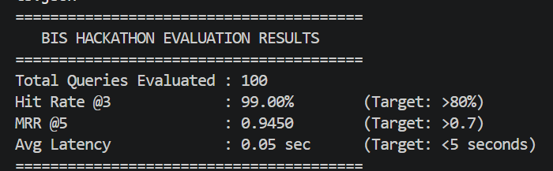

# BIS Standards Finder — AI-Powered Compliance Retrieval

An AI-powered system that maps natural language queries to relevant Bureau of Indian Standards (BIS) codes. Eliminates manual search through large documents using a hybrid retrieval pipeline combining semantic understanding with keyword-based matching.

---

## Quick Start

### Step 1 — Environment Setup

Run the setup script once before anything else. It creates the virtual environment, installs all dependencies, and then runs inference automatically.

## Environment Setup

### 1. Python Version

```
Python 3.11
```

### 2. Create Virtual Environment

```bash
 py -3.11 -m venv venv 
```

Activate on Windows:

```bat
venv\Scripts\activate
```

Activate on Mac/Linux:

```bash
source venv/bin/activate
```

### 3. Install Dependencies

```bash
pip install --upgrade pip
pip install -r requirements.txt
```

## Run Inference

If the environment is already set up and you only need to re-run inference:

```bash
python inference.py --input hidden_private_dataset.json --output team_results.json
```
---

## Evaluation

```bash
python eval_script.py --results team_results.json
```

## Web Interface (Optional)

A hosted interface is available for interactive testing:

```
https://mse-hackathon.web.app/
```

> If the FAISS index is present, the system works directly. If the index is not found, please see below

## 🔑 Groq API Key (Optional – Smart Rationale Generation)

To enable AI-powered reasoning and smart explanations in the UI, you can provide a Groq API key.

###  How to Use
1. Open the web interface  
2. Locate the **API Key input field**  
3. Paste your Groq API key  
4. Run your query — the system will now generate **enhanced rationales using LLMs**

### 🔗 Get Your API Key
You can generate your API key from:

👉 :contentReference[oaicite:0]{index=0} — https://console.groq.com/

###  Notes
- If no API key is provided → the system will still work using **retrieval-only mode**
- If API key is provided → enables **LLM-based explanation (smart rationale generation)**
- Your key is **not stored** and is only used during the session

---

## Core Features

- Natural language query to BIS standard mapping
- Hybrid retrieval pipeline:
  - Dense retrieval using embeddings (FAISS)
  - Sparse retrieval using BM25
  - Reciprocal Rank Fusion (RRF)
- Part-number aware filtering (e.g., Part 1, Part 2)
- Batch inference support
- Optimized for low-latency retrieval

---

## System Pipeline

```
1. Query preprocessing and validation
2. Dense retrieval using embeddings
3. Sparse retrieval using BM25
4. Fusion using Reciprocal Rank Fusion (RRF)
5. Part-number prioritization
6. Final result selection
```
---
##  Evaluation Results

The system was evaluated on 100 queries with strong performance across all key metrics.

###  Metrics
- **Hit Rate @3**: 99.00% (Target: >80%)  
- **MRR @5**: 0.9450 (Target: >0.7)  
- **Average Latency**: 0.05 sec (Target: <5 sec)

###  Evaluation Screenshot


## Project Structure

```
bisrag/
|
+-- data/
|   +-- index/
|       +-- bm25.pkl
|       +-- faiss.index
|       +-- metadata.pkl
|
+-- src/
|   +-- pipeline.py
|   +-- retriever.py
|   +-- index_builder.py
|   +-- query_preprocessor.py
|   +-- ...
|
+-- inference.py
+-- eval_script.py
+-- build_index.py
+-- requirements.txt
+-- start.bat
+-- start.sh
+-- README.md
```

---

## Index Setup

Ensure the FAISS index exists at:

```
data/index/faiss.index
```

If missing, rebuild it:

```bash
python build_index.py --chunks data/chunks.json
```

---

## Output Format

```json
[
  {
    "id": "Q-001",
    "query": "...",
    "expected_standards": [...],
    "retrieved_standards": [...],
    "latency_seconds": 0.45
  }
]
```


### Metrics

| Metric | Description |
|--------|-------------|
| Hit@K | Fraction of queries where the correct standard appears in the top K results |
| MRR | Mean Reciprocal Rank — average of reciprocal ranks of the first correct result |
| Latency | Average retrieval time per query in seconds |

---

## Notes

- Optimized for steady-state latency; cold start is excluded from benchmarks
- Fully local retrieval — no API required unless explicitly configured
- Designed for robustness on unseen queries
